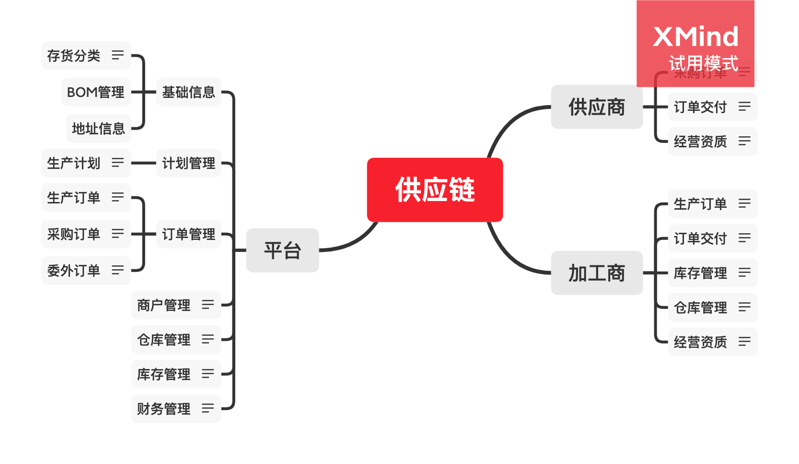

产品
分类
bom
计划
订单（采购、生产、委外）
库存流水（采购订单出入库、生产订单出入库、委外订单出入库、销售出入库、调拨出入库、盘点出入库、其它出入库）
仓库
商户（加工商、供应商）

https://www.jianshu.com/p/c8b43fcabbce

工程BOM：

产品工程设计管理中使用的数据结构，它通常精确地描述了产品的设计指标和零件与零件之间的设计关系。对应文件形式主要有产品明细表、图样目录、材料定额明细表、产品各种分类明细表等等。

计划BOM：

工艺工程师根据工厂的加工水平和能力，对EBOM再设计出来的。

设计BOM：

DBOM(Design BOM)设计部门的DBOM是产品的总体信息，对应常见文本格式表现形式包括产品明细表、图样目录、材料定额明细表等等。

制造BOM：

MBOM(Manufacturing BOM)生产部门的MBOM是在EBOM的基础上，根据制造装配要求完善的，包括加工零部件JBOM和按工艺要求的毛胚、模具、卡具等PBOM。其中在每个工序或工步上要特别注明在本工序上装入零部件代号、名称和数量。

客户BOM：

CBOM(Customer BOM)客户BOM实际上有两个含义，一个指从所有产品机构中筛选出客户订购的产品目录。一个指用户订购的具体规格产品的明细表。

维修BOM：

WBOM维修服务部门的是按维修要求产生的，对应文本格式包括消耗件清单、备用件清单、易损易耗件清单等等。维修BOM信息来源一般从设计BOM对应记录属性中筛选获得消耗件、备用件、易损易耗件明细。

销售BOM：

SBOM（SALE BOM）销售BOM是按用户要求配置的产品结构部分。对应常见文本格式表现形式包括基本件明细表、通用件明细表、专用件明细表、选装件明细表、替换件明细表、特殊要求更改通知单等等。

成本BOM：

CBOM（Costing Bill Of Material）是由MRPⅡ系统产生出来的。当企业定义了零件的标准成本、建议成本、现行成本的管理标准后，系统通过对PBOM和加工中心的累加自动地生成CBOM。它用于制造成本控制和成本差异分析。

采购BOM：

CBOM是根据生产要求外购的原材料、标准件和成套部件等产生的，对应文本格式主要包括外购件明细表、外协件明细表、自制件明细表和材料明细汇总表。采购BOM信息来源一般来源于设计图纸和工艺卡片上信息汇总。由采购部门或生产准备部门根据其安排采购计划和生产计划。